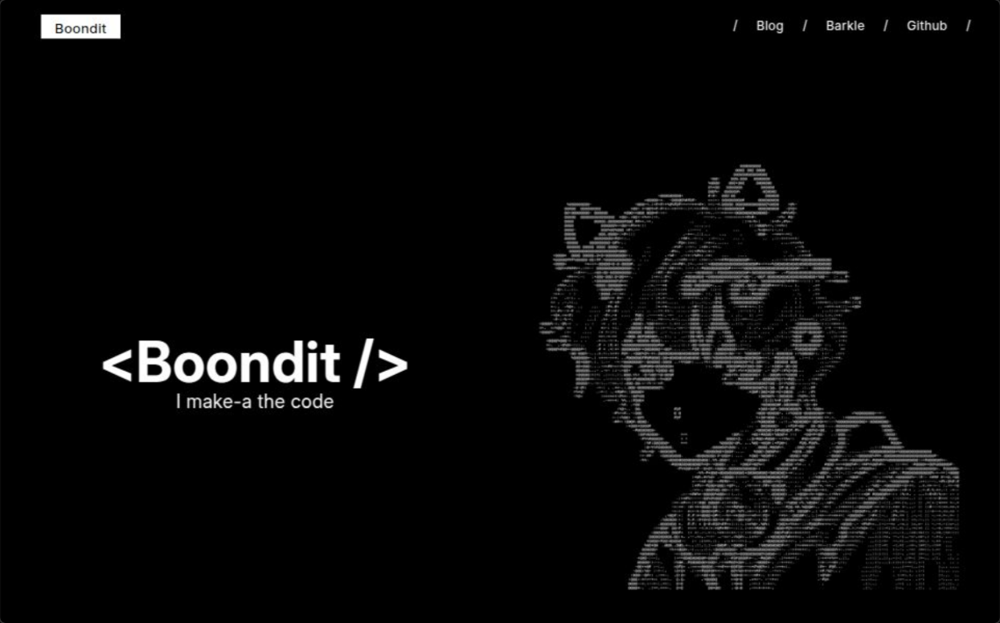

<h1 align="center">Boondit</h1>
<h2 align="center">MYYYYYY BLOGGGGGG</h2>

<p align="center">
    
</p>

## 🌟 Features

> **token-template** features intro:

- **Minimalist Design** – Black-and-white terminal-inspired aesthetics with custom fonts.
- **Astro + Tailwind CSS** – Built using Astro and styled with Tailwind CSS for easy customization.
- **Content Support** – Write blog posts or documentation in Markdown (MD) and MDX.
- **Static and Fast** – Fully static content optimized for performance.

## 💻 Installation

> [!TIP]
> Remember to update [`src/consts.ts`](https://github.com/AidanTheBandit/boondit-site/blob/main/src/consts.ts)

###### terminal

```bash
# Clone the repository
git clone https://github.com/AidanTheBandit/boondit-site.git my-portfolio
cd my-portfolio

# Install dependencies
npm install

# Run the development server
npm run dev
```

## 📷 Screenshots

> Here's a working and expected screenshot of **token-template**

| Landing Page                    |
| ------------------------------- |
|  |

---

## 💻 Contributing

> [!TIP]  
> We welcome contributions to improve **token-template**! If you have suggestions, bug fixes, or new feature ideas, follow these steps:

1. **Fork the Repository**  
   Click the **Fork** button at the top-right of the repo page.

2. **Clone Your Fork**  
   Clone the repo locally:

   ```bash
   git clone https://github.com/ArnavK-09/token-template.git
   ```

3. **Create a Branch**  
   Create a new branch for your changes:

   ```bash
   git checkout -b your-feature-branch
   ```

4. **Make Changes**  
   Implement your changes (bug fixes, features, etc.).

5. **Commit and Push**  
   Commit your changes and push the branch:

   ```bash
   git commit -m "feat(scope): description"
   git push origin your-feature-branch
   ```

6. **Open a Pull Request**  
   Open a PR with a detailed description of your changes.

7. **Collaborate and Merge**  
   The maintainers will review your PR, request changes if needed, and merge it once approved.
